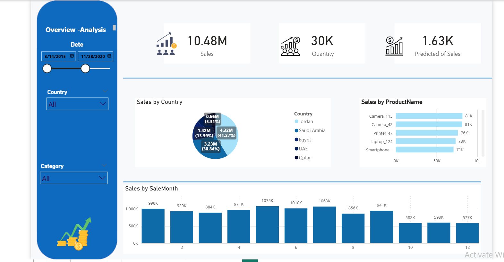
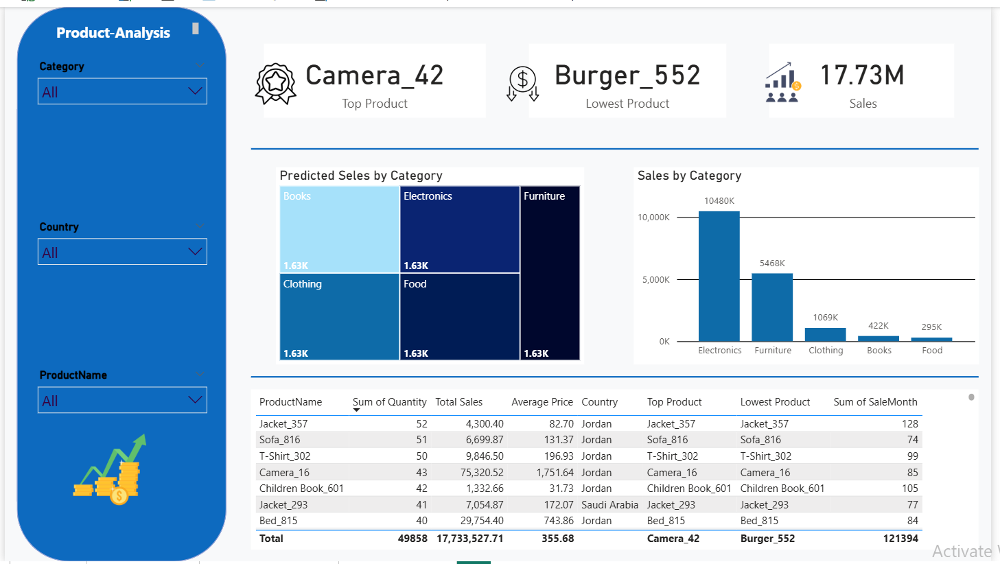

# 📊 Sales & Employee Performance Analysis Dashboard – Power BI

## 📌 Overview
This Power BI dashboard provides a complete overview of **sales performance**, **employee productivity**, and **country-level insights**.  
It is designed to help business leaders, sales managers, and analysts make data-driven decisions using clear KPIs and interactive visualizations.

The dashboard consists of **two main analytical views**:
1. **Sales Overview Analysis**
2. **Employee Performance Analysis**

---

# 🧭 1. Sales Overview – Analysis

## 🎯 Key Metrics
- **Total Sales:** 10.48M  
- **Quantity Sold:** 30K  
- **Predicted Sales:** 1.63K  

---

## 📈 Visual Insights
### **Sales by Country**
- Saudi Arabia leads with ~4.32M (41.27%)
- UAE & Egypt contribute significantly
- Qatar and Jordan have smaller shares

### **Sales by Product Name**
Top selling items include:
- Camera_115 → 81K  
- Camera_42 → 81K  
- Printer_47 → 76K  
- Laptop_124 → 73K  
- Smartphone_22 → 71K  

### **Sales by Month**
Monthly patterns show:
- Peak sales around Apr–Jun (971K → 1.07M → 1.06M)
- Lower performance toward year-end

---

## 🗂 Filters
- **Date Range Slider**
- **Country**
- **Category**

---

# 👥 2. Employee – Analysis

## 🎯 Key Employee Metrics
- **Sales per Employee:** 17.73M  
- **Top Employee:** Hassan Shami  
- **Total Sales per Employee:** 190  

---

## 📊 Visual Insights
### **Sales by Employee Name**
Top performers:
- Hassan Shami → 0.26M  
- Noor Najjar → 0.22M  
- Aya Haddad → 0.21M  
- Huda Shami → 0.21M  
- Several employees between 0.19M–0.21M  

### **Sales by Department**
Department share:
- **Sales:** 7.8M (43.9%)
- **Support:** 2.81M
- **HR:** 3.08M  
- **IT:** 2.22M  
- **Management:** 1.82M  

### **Sales per Employee by Month**
Shows monthly productivity curve:
- Strong productivity around May–July  
- Lower performance at year-end (Dec)  

---

## 🗂 Filters
- Customer Name  
- Department  
- Sale Date Range  

---

# 📷 Dashboard Preview

**Sales Overview:**

**Employee Analysis:**

.

---

# 🛠 Tools Used
- Power BI  
- Power Query  
- DAX Measures  
- Forecasting  
- Data Modeling  
- Interactive Filters & Slicers  
- UI/UX Dashboard Design  

---

# 📦 Files Included
- `Sales_Employee_Analysis.pbix`
- `Sales_Overview.png`
- `Employee_Analysis.png`
- `sales_data.csv` *
- `README.md`

---

# 🎉 Conclusion
This dashboard gives a **complete and actionable view** of company performance across:
- Sales  
- Geography  
- Products  
- Employees  
- Departments  
- Time periods  

It is a powerful tool for strategic decision-making and business improvement.

